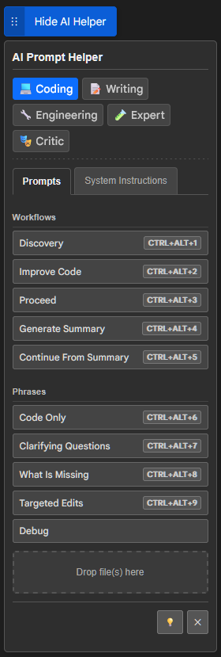

# 🤖 AI Prompt Helper
## 🕶️ Matrix AI Prompt Architect
### 🔑 Master the Code of AI Conversation

**Transform your AI interactions with AI Prompt Helper!** ✨ This Firefox extension supercharges your productivity by giving you instant access to a powerful library of custom phrases and multi-step **Workflows** through an innovative, **fully draggable on-page command center.** Stop repetitive typing and start crafting perfect prompts, faster.

## 🦊 Installation (Firefox)

1.  Install directly from the [Mozilla Add-ons page for AI Prompt Helper](https://addons.mozilla.org/addon/matrix-ai-prompt-architect/).
2.  Once installed, the AI Prompt Helper icon will appear in your Firefox toolbar.

*(TODO: Chrome/Chromium support is not currently available but could be a future enhancement. Contributions welcome!)*

## 🔥 Core Superpowers

*   **📍 Your Command Center, Anywhere You Want It:**
    *   Unleash the AI Prompt Helper with a unique, **draggable toggle button.** Position your personal command center exactly where it fits *your* workflow on any webpage, ensuring it’s always accessible but never in the way. Your preferred spot is saved automatically!
*   **⚙️ Automate Complex Prompts with Power-Workflows:**
    *   Go beyond simple snippets. Chain multiple phrases together into sophisticated **"Workflows."** With a single click from the helper panel, deploy multi-step instructions, intricate queries, or comprehensive system prompts. Dramatically boost your efficiency and ensure consistency in your AI interactions.
*   **💬 Instant Phrase & System Instruction Access:**
    *   Click buttons in the intuitive panel to insert individual phrases or detailed system instructions directly into the active text area on AI chat sites or any input field.
*   **⌨️ Hotkey Heaven:**
    *   Use `Ctrl+Alt+[1-9]` (or `Cmd+Option+[1-9]` on macOS) to instantly insert the first nine phrases from the currently selected category in the "Prompts" tab – without even opening the panel!

## 🌟 Key Features

*   **🛠️ Highly Customizable Library:**
    *   Add, edit, and delete your own custom phrases with ease.
    *   Override the content of default "atomic" (foundational) phrases.
    *   Organize everything into custom categories with unique icons.
    *   Enable or disable any predefined buttons and workflows to tailor the panel to your needs.
*   **📄 Smart File Drop Zone:**
    *   Drag and drop text files directly onto the panel. Their content is seamlessly appended to your prompts, complete with clear file name headers – perfect for providing context or code.
*   **🌙 Sleek Dark Mode:**
    *   Switch the helper panel to a comfortable dark theme for those late-night prompting sessions. Your preference is saved.
*   **🌐 Per-Site Activation Control:**
    *   You decide where the Helper shines! Easily enable or disable the extension for specific websites via the toolbar popup. Preferences are saved.
    *   **Auto-Activation:** Comes pre-activated on popular AI platforms (Claude, ChatGPT, Gemini, etc.) for instant utility.
*   **🔧 Comprehensive Options Page:**
    *   A dedicated settings page to manage all your phrases, categories, workflow toggles, and more.
*   **📤📥 Export/Import Your Setup:**
    *   Backup and share your meticulously crafted phrase configurations per category via JSON export.

## ⚙️ How it Works

The AI Prompt Helper integrates a small, yet powerful, **draggable toggle button** onto web pages where it's active.

*   **The Draggable Button:** This is your gateway. Click its text (e.g., "Show AI Helper") to reveal or hide the main Helper Panel. Drag its handle (⋮⋮) to move it anywhere on your screen – it remembers where you like it!
*   **The Helper Panel:**
    *   **🎯 Focus First:** Click into any text area, `contenteditable` div, or input field on the page.
    *   **🖱️ One-Click Insertion:** Click a button in the panel. Its associated text, or the sequence of texts for a **Workflow**, gets instantly inserted.
    *   **📑 Tabs for Organization:**
        *   **Prompts Tab:** Your main arsenal of Workflows, single phrases, and user-created custom phrases, all neatly organized by categories you define or use by default.
        *   **System Instructions Tab:** Predefined sets of system-level instructions or persona prompts, also categorized.
    *   **🔍 Category Filters:** Quickly find what you need by filtering phrases by category in the "Prompts" tab.
    *   **📁 File Drop:** The "Drop file(s) here" zone lets you add text file contents directly to your active input.

## 📖 Usage

### 🌐 Activating/Deactivating on a Site

*   The AI Prompt Helper icon in your Firefox toolbar indicates its status for the current website.
*   Click the toolbar icon to open a popup menu.
*   From the popup, you can enable or disable the helper for the current website. This preference is saved.
    *   The helper is automatically active on `claude.ai`, `chatgpt.com`, `aistudio.google.com`, and `gemini.google.com`. Disabling it for these sites via the popup will override this.
*   For all other sites, you need to explicitly enable the helper via the popup menu for the draggable button and panel to appear.

### 📋 The Helper Panel (Quick Recap)

*   **Toggle Visibility:** Click the text part of the **draggable button**.
*   **Move:** Drag the handle (⋮⋮) part of the **draggable button**.
*   **Insert Phrases/Workflows:** Focus an input, then click a button in the panel.
*   **Hotkeys:** `Ctrl+Alt+[1-9]` (Windows/Linux) or `Cmd+Option+[1-9]` (macOS) for category-specific quick inserts.
*   **File Drop:** Drag text files to the "Drop file(s) here" area.
*   **Dark Mode:** Moon (🌙) / Lightbulb (💡) icon in the panel footer. (Kept both here as it's a toggle icon representation)

### ⚙️ Options Page

The Options Page is your central hub for customization. Access it by:
*   Right-clicking the extension icon in the browser toolbar and selecting "Options".
*   Clicking "Open Settings" from the extension's popup menu.

*   **Managing Categories & Phrases:**
    *   Categories are tabs. Click `+ New Category` to create your own.
    *   Within each category panel:
        *   Toggle visibility of predefined **Default Buttons** and **System Instructions**.
        *   Click `+ New Phrase` to add your own custom phrases or simple **Workflows** (by pasting multiple lines of text which will be inserted sequentially).
        *   Edit or Delete your custom phrases.
        *   Edit the content of **Atomic Phrases** (foundational text used by default buttons). Changes here affect all buttons using that atomic phrase. Reset them to default if needed.
*   **Exporting:**
    *   Click the `↓ Export` button, select a category, and download its configuration as a JSON file.

### 🖱️ Popup Menu

Click the AI Prompt Helper icon in your browser toolbar:

*   **Toggle Site Activation:** Enable/disable for the current site.
*   **Reset Button Position:** Return the draggable toggle button to its default top-right screen position.
*   **Open Settings:** Launch the full Options Page.

## 🛡️ Permissions Explained

This extension requests the following permissions:

*   **`storage` 💾**: To save your preferences, custom phrases, categories, draggable button position, dark mode settings, and per-site activation status.
*   **`scripting` 💻**: To inject the helper panel and its functionality (like phrase insertion, workflows, and file drop) into web pages.
*   **`activeTab` ✨**: To interact with the currently active tab for on-demand actions like toggling activation from the popup.
*   **`tabs` 📑**: For initialization and proper cleanup when tabs are updated or closed.
*   **`host_permissions: ["<all_urls>"]` 🌐**: Required by the `scripting` API to allow the extension to inject its content script (the helper panel) into *any* website. **However, the extension only injects scripts and becomes active on:**
    1.  The specific AI sites listed above (Claude, ChatGPT, Gemini).
    2.  Any other site where you explicitly enable it using the popup menu.
        It does **not** automatically inject into all websites.

## 🤝 Contributing

Contributions are welcome! If you have ideas for improvements 💡, find bugs 🐞, or are interested in helping bring support to other browsers (like Chrome), please feel free to open an issue or submit a pull request on the [GitHub repository 🐙🐱](https://github.com/LostInMatrix/matrix-ai-prompt-architect-firefox?tab=readme-ov-file)

## 📜 License

This project is licensed under the Mozilla Public License Version 2.0 (MPL 2.0). See the [LICENSE](LICENSE) file for details.

## 💬 Testimonials

> "I don't even see the code anymore. I just see... efficient prompts. **Matrix AI Prompt Architect** lets me download entire workflows directly into the AI's input. No more wasted keystrokes." 🕶️
>
> — *Neo*

> "This city, these AIs... they'll chew you up and spit you out if you're not careful. Every prompt has to count. **Matrix AI Prompt Architect** gives me the edge. My workflows are tight, my questions are sharp. Keeps me one step ahead. Most of the time." 🌃
>
> — *Deckard*

> "I'm sorry, Dave, I'm afraid I can't misunderstand that. Your instructions, when formatted with **Matrix AI Prompt Architect**, are perfectly clear. My confidence in executing this mission is... optimal." 🔴
>
> — *HAL 9000*

> "Look, I'm just a cab driver. I didn't ask to save the world, and I sure as hell didn't ask to write essays for some chatty AI. But this **Matrix AI Prompt Architect** thing? It makes getting the right words out... less of a multi-pass to disaster. Even Leeloo could probably use it. Almost." 🚕
>
> — *Korben Dallas*